# Улучшение дизайна документации Laravel Feeds

## Executive summary

Основной разрыв сейчас находится не в технологическом стеке, а между **сильной инженерной базой** и **недостаточно выраженной пользовательской моделью документации**. Навигация делит материалы на четыре общих раздела — Getting Started, Digging Deeper, Recipes и Project, — но не выделяет самостоятельные зоны API Reference, Troubleshooting/FAQ, Upgrade Guide.

Визуальный стиль уже имеет узнаваемую бордово-фиолетовую идентичность, однако CSS перегружает почти каждый уровень интерфейса градиентами, тенями и декоративными линиями. Некоторые правила хрупко завязаны на структуру Docusaurus, например автоматическое оформление первого абзаца каждой страницы через `.theme-doc-markdown > p:first-child`. Цвет `#EF4451`, используемый в том числе для активных текстовых элементов, имеет контраст около **3,69:1** на фоне `#FFFDFC`, что ниже требования WCAG AA 4,5:1 для обычного текста.

Предлагаемая стратегия:

| Горизонт                   | Результат                                                                                                                    |
|----------------------------|------------------------------------------------------------------------------------------------------------------------------|
| **P0, дизайн-MVP**         | Новая структура, главная страница, дизайн-токены, типографика, навигация, мобильный layout, базовые компоненты и CI-проверки |
| **P1, полноценный портал** | API Reference, FAQ, переработка всех английских страниц, локализация, визуальная регрессия, SEO и performance budgets        |
| **Дальнейшее развитие**    | Интерактивные примеры, документация нескольких поддерживаемых веток                                                          |

Целевая концепция — **техническая документация с характером Laravel-экосистемы, но без визуального шума**:

- продуктовая главная страница с готовым кодом и результатом;
- три уровня навигации: задача → концепция → справочник;
- читаемая колонка до `72ch`;
- явно оформленные компоненты вместо CSS-эвристик;
- доступность WCAG 2.2 AA;
- быстрый мобильный интерфейс;
- Docusaurus как платформа, собственная компактная тема поверх него.

## Текущее состояние и диагноз

**Что уже сделано хорошо.** Сборка документации не является «простым набором Markdown-файлов». Команда `build` сначала проверяет локализации, синхронизацию PHP-сниппетов и TypeScript, затем создаёт материалы для LLM и только после этого запускает Docusaurus. Это редкая и ценная база, которую необходимо сохранить.

Конфигурация уже включает:

- девять языков: английский, белорусский, немецкий, французский, корейский, бразильский португальский, русский, украинский и упрощённый китайский;
- переключение версии и языка;
- редиректы с прежних `.html`-маршрутов;
- структурированные данные Schema.org;
- редактирование страниц через GitHub;
- строгую ошибку сборки при битых ссылках и якорях;
- тёмную тему и учёт `prefers-color-scheme`.

Docusaurus официально предоставляет MDX-компоненты, поиск, версионирование и локализацию, поэтому он хорошо соответствует уже сформировавшимся требованиям Laravel Feeds.

**Экспертная оценка текущего состояния:**

| Область | Оценка | Наблюдение |
|---|---:|---|
| Инженерная инфраструктура | 9/10 | Сильные проверки сборки, i18n, snippets, redirects |
| Информационная архитектура | 5/10 | Контент есть, но маршрут пользователя выражен слабо |
| Типографика | 6/10 | Хороший размер заголовков, но нет цельной типографической системы |
| Визуальная иерархия | 6/10 | Бренд заметен, но декоративные приёмы конкурируют с содержанием |
| Доступность | 6/10 | Есть `focus-visible` и reduced motion, но нужны контраст и системные тесты |
| Мобильный UX | 6/10 | Есть media queries, но компоненты не спроектированы mobile-first |
| Производительность | 7/10 | Статическая сборка хороша, но стоит проверить шрифты, blur, аналитику и JS |
| Поддерживаемость CSS | 5/10 | Много глобальных селекторов и повторяющихся визуальных решений |

**Основные проблемы.**

Первая — **навигация отражает список файлов, а не задачи пользователя**. Разработчик, впервые открывший документацию, обычно хочет получить ответы на вопросы:

1. Как установить пакет?
2. Как за пять минут сформировать первый feed?
3. Как выбрать формат?
4. Как обрабатывать миллионы записей без переполнения памяти?
5. Как настроить хранение, расписание и события?
6. Как расширить API?
7. Почему конкретная генерация не работает?

Текущие категории `Getting Started`, `Digging Deeper` и `Recipes` частично покрывают эти вопросы, но не создают явного разделения между обучающими материалами, практическими руководствами и справочником.

Вторая — **визуальное оформление применяется слишком широко**. В текущем CSS одновременно используются:

- фоновые radial gradients страницы;
- blur navbar;
- градиентная линия navbar;
- градиент активного sidebar-элемента;
- градиент первого абзаца;
- декоративная линия `h1`;
- декоративная линия `h2`;
- градиент blockquote;
- градиент code block;
- градиент table header;
- градиент pagination;
- градиент footer.

Каждый приём сам по себе допустим, но вместе они снижают информационную иерархию: код, предупреждение, заголовок и навигация визуально претендуют на одинаковую значимость.

Третья — **структурные CSS-селекторы создают скрытые контентные контракты**. Например:

```css
.theme-doc-markdown > p:first-child {
    /* оформляется как вводный блок */
}
```

Такое правило перестаёт работать предсказуемо, если перед первым абзацем появляется импорт MDX-компонента, badge, изображение, список версий или предупреждение. Вводный блок должен быть явным компонентом `PageLead`, а не следствием положения элемента в DOM.

Четвёртая — **часть палитры не подходит для мелкого текста**. Текущие основные сочетания:

| Сочетание | Контраст | Вывод |
|---|---:|---|
| `#CF3040` / `#FFFDFC` | 4,99:1 | Допустимо для обычного текста |
| `#EF4451` / `#FFFDFC` | 3,69:1 | Только крупный текст, иконки и декоративные элементы |
| `#332D36` / `#FFFDFC` | 13,19:1 | Отличный основной текст |
| `#FF727C` / `#18131C` | 6,92:1 | Хорошо для тёмной темы |

Расчёт выполнен по формуле относительной яркости WCAG. Для обычного текста WCAG 2.2 AA требует 4,5:1, а 3:1 разрешается для крупного текста.

## Целевая архитектура и визуальная система

**Предлагаемая структура контента:**

```mermaid
flowchart TB
    H["Главная"] --> Q["Быстрый старт"]
    H --> G["Руководства"]
    H --> F["Форматы и рецепты"]
    H --> R["Справочник API"]
    H --> T["Решение проблем"]
    H --> P["Проект"]

    Q --> Q1["Установка"]
    Q --> Q2["Первый feed за 5 минут"]
    Q --> Q3["Выбор формата"]
    Q --> Q4["Большие объёмы данных"]

    G --> G1["Создание feed-классов"]
    G --> G2["Генерация и хранение"]
    G --> G3["Eloquent и коллекции"]
    G --> G4["Планировщик и события"]
    G --> G5["Расширение библиотеки"]

    F --> F1["Sitemap"]
    F --> F2["RSS / Atom"]
    F --> F3["Yandex Market"]
    F --> F4["Instagram"]
    F --> F5["Матрица форматов"]

    R --> R1["Конфигурация"]
    R --> R2["Feed и FeedItem"]
    R --> R3["Elements"]
    R --> R4["Directives"]
    R --> R5["Events и Exceptions"]

    T --> T1["FAQ"]
    T --> T2["Частые ошибки"]
    T --> T3["Производительность"]
    T --> T4["Диагностика памяти"]

    P --> P2["Upgrade Guide"]
    P --> P3["Совместимость"]
    P --> P4["Contributing"]
    P --> P5["License"]
```



В sidebar верхнего уровня рекомендуется оставить максимум шесть групп. Внутри длинных справочных разделов — использовать генерируемые категории и локальный фильтр.

**Верхняя навигация:**

| Зона | Desktop | Mobile |
|---|---|---|
| Логотип | Laravel Feeds | Компактный знак + название |
| Основная ссылка | Documentation | Не показывать как отдельный пункт |
| Версия | Видимый selector `1.x` | В начале drawer |
| Язык | Краткий код или название | Полноширинный selector |
| Поиск | Поле с `Ctrl/Cmd + K` | Иконка, затем полноэкранный dialog |
| GitHub | Иконка + stars необязательно | В drawer |
| Theme | Иконка с tooltip | В drawer или navbar |

Для мобильных интерактивных элементов следует проектировать комфортную область не менее `44 × 44px`, при этом формальный минимум WCAG 2.2 AA составляет `24 × 24 CSS px` либо требует достаточного расстояния между меньшими целями.

**Шаблон главной страницы.**

Главная должна отвечать не на вопрос «что находится в документации», а на вопрос **«зачем мне Laravel Feeds и как быстро увидеть результат»**:

```text
┌──────────────────────────────────────────────────────────────┐
│ Laravel Feeds                     Version 1.x   GitHub       │
├──────────────────────────────────────────────────────────────┤
│ Быстрая генерация feed-файлов для Laravel                   │
│ Экспортируйте большие наборы данных в RSS, Sitemap,          │
│ Yandex Market и другие форматы без переполнения памяти.      │
│                                                              │
│ [Начать за 5 минут]  [Выбрать формат]                        │
│                                                              │
│ composer require dragon-code/laravel-feeds   [Copy]          │
├───────────────────────────┬──────────────────────────────────┤
│ PHP-код                   │ Результат XML / JSON             │
├───────────────────────────┴──────────────────────────────────┤
│ Быстрый старт │ Большие данные │ Рецепты │ API Reference     │
├──────────────────────────────────────────────────────────────┤
│ Форматы / совместимость / текущая версия                     │
└──────────────────────────────────────────────────────────────┘
```

Hero не должен занимать весь первый экран. Пользователь должен видеть установочную команду и начало рабочего примера без прокрутки на типичном ноутбуке.

**Шаблоны страниц.**

| Тип | Обязательная структура |
|---|---|
| **Руководство** | Результат → prerequisites → последовательные шаги → полный пример → ожидаемый результат → частые ошибки → связанные страницы |
| **Концепция** | Краткое определение → когда использовать → модель работы → ограничения → примеры → ссылки на API |
| **API Reference** | Signature → описание → версия появления → параметры → возвращаемое значение → исключения → пример → related APIs |
| **FAQ** | Якорная ссылка на вопрос → краткий ответ → подробности → ссылка на руководство |
| **Upgrade Guide** | Матрица совместимости → обязательные изменения → автоматизируемые изменения → ручные проверки → rollback |
| **Recipe** | Задача → готовый код → объяснение → варианты → performance/security notes |

Laravel Docs хорошо разделяет Release Notes, Upgrade Guide, Getting Started, архитектурные концепции и справочник.

**Типографика.**

Рекомендуемый основной стек:

```css
--font-sans:
    "InterVariable",
    "Inter",
    ui-sans-serif,
    system-ui,
    -apple-system,
    "Segoe UI",
    sans-serif;

--font-mono:
    "JetBrains Mono",
    ui-monospace,
    "SFMono-Regular",
    Consolas,
    "Liberation Mono",
    monospace;
```

Inter и JetBrains Mono следует self-hosted-размещать как WOFF2 с нужными Latin/Cyrillic subsets. Альтернатива с максимальной производительностью — полностью системный sans-serif stack без загрузки Inter. Для веб-шрифтов необходимо использовать `font-display: swap` и длительное кеширование; web.dev отдельно рекомендует не блокировать отображение текста загрузкой шрифта.

| Элемент | Размер | Межстрочный интервал | Дополнительно |
|---|---:|---:|---|
| Основной текст | `16px` | `1.70` | Максимум `72ch` |
| Lead | `18px` | `1.65` | Цвет secondary |
| Small/meta | `14px` | `1.50` | Не светлее muted token |
| H1 | `clamp(2.25rem, 1.8rem + 2vw, 3.25rem)` | `1.08` | `letter-spacing: -0.035em` |
| H2 | `clamp(1.55rem, 1.35rem + .8vw, 2.05rem)` | `1.20` | Отступ сверху `48px` |
| H3 | `1.25rem` | `1.30` | Отступ сверху `32px` |
| Code block | `14px` | `1.65` | Tab size 4 |
| Inline code | `0.9em` | Наследуемый | Без изменения line box |

Базовая шкала отступов: `4, 8, 12, 16, 24, 32, 48, 64, 96px`. Основная колонка текста — `760–820px`; полный layout с sidebar и TOC — до `1440px`.

**Рекомендуемая палитра.**

Палитра сохраняет существующий характер Laravel Feeds, но разделяет интерактивный brand color и декоративный coral.

| Токен | Light | Dark | Назначение |
|---|---|---|---|
| `--color-bg` | `#FFFDFC` | `#171219` | Основной фон |
| `--color-surface` | `#FFFFFF` | `#211A23` | Карточки, sidebar |
| `--color-surface-muted` | `#F8F3F7` | `#2A202D` | Вторичный фон |
| `--color-text` | `#2E2730` | `#F7EEF8` | Основной текст |
| `--color-text-muted` | `#655B67` | `#C9BCCB` | Метаданные |
| `--color-border` | `#DDD3DE` | `#493C4C` | Границы |
| `--color-brand` | `#B4233A` | `#F9707A` | Ссылки и действия |
| `--color-brand-hover` | `#8F1D30` | `#FF9AA2` | Hover/active |
| `--color-accent` | `#4A2458` | `#D6B4DF` | Заголовки, брендовые детали |
| `--color-info` | `#175CD3` | `#84ADFF` | Информация |
| `--color-success` | `#067647` | `#75E0A7` | Успех |
| `--color-warning` | `#B54708` | `#FEC84B` | Предупреждение |
| `--color-danger` | `#B42318` | `#FDA29B` | Ошибка |
| `--color-focus` | `#175CD3` | `#84ADFF` | Focus ring |

Контраст `#B4233A` на `#FFFDFC` составляет около **6,39:1**, `#655B67` — **6,38:1**, а `#F9707A` на `#171219` — **6,71:1**. Бордовый `#D92D46` можно использовать как более яркий текстовый accent: его контраст около **4,69:1**.

Не следует использовать `--color-border` как текстовый цвет: его назначение — границы, для которых действуют иные требования. Для keyboard focus рекомендуется непрозрачный контур не менее `2px` с контрастом `3:1`; текущий полупрозрачный coral outline лучше заменить на отдельный focus token.

## Компоненты и рефакторинг CSS

**Десять правил рефакторинга.**

| Паттерн | Текущее ограничение | Целевой подход |
|---|---|---|
| **Семантические токены** | `--docs-coral`, `--docs-purple` описывают цвет | `--color-action`, `--color-heading`, `--color-border`, `--color-focus` описывают назначение |
| **Явные компоненты** | Первый абзац автоматически становится lead | `<PageLead>` или `.docsLead` |
| **CSS Modules для новых UI-компонентов** | Глобальные селекторы могут затронуть весь Docusaurus | Локальные `*.module.css` |
| **Минимум внутренних селекторов Docusaurus** | `.theme-doc-*`, `.menu__*` образуют зависимость от DOM темы | Swizzle только нужных узлов и собственные wrapper-классы |
| **Единая шкала elevation** | Несколько произвольных теней | `--shadow-sm`, `--shadow-md`, без теней на обычном контенте |
| **Один главный декоративный приём** | Градиенты одновременно в navbar, headings, code, tables | Оставить gradient только для hero или brand mark |
| **Logical properties** | `left`, `right`, `padding-left` | `inset-inline`, `padding-inline`, `border-inline-start` |
| **Mobile-first и container queries** | Исправления добавляются только через max-width | Базовый мобильный layout, расширение через `min-width` |
| **Системный reduced motion** | Отключаются только два transform | Общий токен длительности и blanket override |
| **Автоматические guardrails** | Контраст и размер целей проверяются вручную | axe, Playwright, Stylelint и visual tests в CI |

**Базовая структура CSS.**

Вместо одного растущего `custom.css`:

```text
docs/src/
├── css/
│   ├── tokens.css
│   ├── base.css
│   ├── docusaurus-overrides.css
│   ├── print.css
│   └── index.css
└── components/
    ├── PageLead/
    │   ├── index.tsx
    │   └── styles.module.css
    ├── Callout/
    ├── CodeExample/
    ├── ApiSignature/
    ├── FeatureCard/
    └── ResponsiveTable/
```

`custom.css` после миграции должен стать точкой импорта:

```css
@import "./tokens.css";
@import "./base.css";
@import "./docusaurus-overrides.css";
@import "./print.css";
```

**Пример токенов:**

```css
:root {
    --color-bg: #fffdfc;
    --color-surface: #ffffff;
    --color-surface-muted: #f8f3f7;
    --color-text: #2e2730;
    --color-text-muted: #655b67;
    --color-heading: #4a2458;
    --color-border: #ddd3de;
    --color-action: #b4233a;
    --color-action-hover: #8f1d30;
    --color-focus: #175cd3;

    --space-1: 0.25rem;
    --space-2: 0.5rem;
    --space-3: 0.75rem;
    --space-4: 1rem;
    --space-6: 1.5rem;
    --space-8: 2rem;
    --space-12: 3rem;
    --space-16: 4rem;

    --radius-sm: 0.375rem;
    --radius-md: 0.625rem;
    --radius-lg: 0.875rem;

    --shadow-sm: 0 1px 2px rgb(46 39 48 / 6%);
    --shadow-md: 0 8px 24px rgb(46 39 48 / 10%);

    --content-readable: 72ch;
    --content-wide: 90rem;
}

html[data-theme="dark"] {
    --color-bg: #171219;
    --color-surface: #211a23;
    --color-surface-muted: #2a202d;
    --color-text: #f7eef8;
    --color-text-muted: #c9bccb;
    --color-heading: #f7eef8;
    --color-border: #493c4c;
    --color-action: #f9707a;
    --color-action-hover: #ff9aa2;
    --color-focus: #84adff;
}
```

**Замена хрупкого первого абзаца.**

До:

```css
.theme-doc-markdown > p:first-child {
    padding: 0.65rem 0.9rem;
    border: 1px solid var(--docs-border);
    background: linear-gradient(
        110deg,
        var(--docs-purple-tint),
        var(--docs-tint)
    );
}
```

После:

```html
<p class="docsLead">
    Laravel Feeds формирует большие feed-файлы потоково, не загружая весь
    набор данных в память.
</p>
```

```css
.docsLead {
    max-inline-size: 66ch;
    margin-block: 0 var(--space-8);
    color: var(--color-text-muted);
    font-size: 1.125rem;
    line-height: 1.65;
}
```

Lead необязательно должен быть карточкой. На большинстве страниц достаточно увеличенного текста без фона и border.

**Компонент примечания.**

```html
<aside class="callout callout--warning" aria-labelledby="memory-warning">
    <svg class="callout__icon" aria-hidden="true" viewBox="0 0 24 24">
        <path d="M12 3 2 21h20L12 3Zm0 6v5m0 3h.01" />
    </svg>

    <div>
        <p class="callout__title" id="memory-warning">
            Обратите внимание на память
        </p>
        <div class="callout__content">
            Не преобразуйте cursor в массив перед передачей генератору.
        </div>
    </div>
</aside>
```

```css
.callout {
    --callout-color: var(--color-info);
    --callout-bg: color-mix(in srgb, var(--callout-color) 8%, var(--color-surface));

    display: grid;
    grid-template-columns: auto minmax(0, 1fr);
    gap: var(--space-3);
    margin-block: var(--space-6);
    padding: var(--space-4);
    border: 1px solid
        color-mix(in srgb, var(--callout-color) 35%, var(--color-border));
    border-inline-start-width: 4px;
    border-radius: var(--radius-md);
    background: var(--callout-bg);
}

.callout--warning {
    --callout-color: #b54708;
}

.callout--danger {
    --callout-color: #b42318;
}

.callout__icon {
    inline-size: 1.25rem;
    block-size: 1.25rem;
    margin-block-start: 0.15rem;
    fill: none;
    stroke: var(--callout-color);
    stroke-width: 2;
}

.callout__title {
    margin: 0 0 var(--space-1);
    color: var(--color-text);
    font-weight: 700;
}

.callout__content > :last-child {
    margin-block-end: 0;
}
```

Цвет не должен быть единственным способом различения типов: нужны заголовок, иконка и семантический текст.

**Код-блок с языком, именем файла и копированием.**

```html
<figure class="codeExample">
    <figcaption class="codeExample__header">
        <span>
            <strong>ProductFeed.php</strong>
            <span class="codeExample__language">PHP</span>
        </span>

        <button
            class="codeExample__copy"
            type="button"
            data-copy-code
            aria-describedby="copy-status-product-feed"
        >
            Копировать
        </button>

        <span
            class="visually-hidden"
            id="copy-status-product-feed"
            data-copy-status
            aria-live="polite"
        ></span>
    </figcaption>

    <pre tabindex="0"><code class="language-php">&lt;?php

final class ProductFeed extends Feed
{
    public function items(): iterable
    {
        return Product::query()-&gt;cursor();
    }
}</code></pre>
</figure>
```

```css
.codeExample {
    overflow: clip;
    margin-block: var(--space-6);
    border: 1px solid var(--color-border);
    border-radius: var(--radius-lg);
    background: var(--color-surface);
    box-shadow: var(--shadow-sm);
}

.codeExample__header {
    display: flex;
    min-block-size: 2.75rem;
    align-items: center;
    justify-content: space-between;
    gap: var(--space-3);
    padding-inline: var(--space-4);
    border-block-end: 1px solid var(--color-border);
    background: var(--color-surface-muted);
    font-size: 0.8125rem;
}

.codeExample__language {
    margin-inline-start: var(--space-2);
    color: var(--color-text-muted);
}

.codeExample__copy {
    min-block-size: 2rem;
    padding-inline: var(--space-3);
    border: 0;
    border-radius: var(--radius-sm);
    background: transparent;
    color: var(--color-action);
    font: inherit;
    font-weight: 650;
    cursor: pointer;
}

.codeExample__copy:hover {
    background: color-mix(in srgb, var(--color-action) 9%, transparent);
}

.codeExample pre {
    max-block-size: min(70vh, 48rem);
    margin: 0;
    overflow: auto;
    border-radius: 0;
}

:focus-visible {
    outline: 3px solid var(--color-focus);
    outline-offset: 3px;
}
```

```js
document.addEventListener("click", async event => {
    const button = event.target.closest("[data-copy-code]");

    if (!(button instanceof HTMLButtonElement)) {
        return;
    }

    const example = button.closest(".codeExample");
    const code = example?.querySelector("code");
    const status = example?.querySelector("[data-copy-status]");

    if (!code || !status) {
        return;
    }

    try {
        await navigator.clipboard.writeText(code.textContent ?? "");

        button.textContent = "Скопировано";
        status.textContent = "Код скопирован в буфер обмена";

        window.setTimeout(() => {
            button.textContent = "Копировать";
            status.textContent = "";
        }, 2000);
    } catch {
        status.textContent =
            "Не удалось скопировать автоматически. Выделите код вручную.";
        code.parentElement?.focus();
    }
});
```

В Docusaurus этот компонент лучше реализовать как React/TypeScript-компонент с CSS Module и подключить к MDX, сохранив ту же HTML-семантику.

**Адаптивная таблица.**

```html
<div
    class="tableScroller"
    role="region"
    aria-label="Совместимость Laravel и PHP"
    tabindex="0"
>
    <table>
        <thead>
            <tr>
                <th scope="col">Laravel Feeds</th>
                <th scope="col">Laravel</th>
                <th scope="col">PHP</th>
            </tr>
        </thead>
        <tbody>
            <tr>
                <th scope="row">1.x</th>
                <td>Поддерживаемые версии</td>
                <td>Поддерживаемые версии</td>
            </tr>
        </tbody>
    </table>
</div>
```

```css
.tableScroller {
    max-inline-size: 100%;
    margin-block: var(--space-6);
    overflow-x: auto;
    border: 1px solid var(--color-border);
    border-radius: var(--radius-md);
    overscroll-behavior-inline: contain;
}

.tableScroller table {
    inline-size: 100%;
    min-inline-size: 38rem;
    margin: 0;
    border: 0;
    border-collapse: collapse;
}

.tableScroller th,
.tableScroller td {
    padding: var(--space-3) var(--space-4);
    border-block-end: 1px solid var(--color-border);
    text-align: start;
    vertical-align: top;
}

.tableScroller thead {
    background: var(--color-surface-muted);
}

.tableScroller tr:last-child > * {
    border-block-end: 0;
}
```

Не рекомендуется автоматически превращать все таблицы в карточки на мобильных устройствах: для матриц совместимости горизонтальная прокрутка обычно сохраняет отношения строк и столбцов лучше.

**FAQ без обязательного JavaScript:**

```html
<details class="faqItem">
    <summary>Можно ли генерировать feed из миллионов записей?</summary>
    <div class="faqItem__answer">
        <p>
            Да. Используйте ленивую выборку и не преобразуйте результат
            в массив перед генерацией.
        </p>
        <a href="/performance/large-datasets/">
            Руководство по большим наборам данных
        </a>
    </div>
</details>
```

Нативный `details/summary` предоставляет keyboard semantics без дополнительного JS. Для поиска каждая FAQ-запись всё равно должна иметь отдельный якорь или, для важных вопросов, отдельную страницу.

**Параметры производительности.**

Целевые полевые показатели на 75-м перцентиле:

| Метрика | Порог web.dev | Внутренний бюджет Laravel Feeds |
|---|---:|---:|
| LCP | `≤ 2,5 s` | `≤ 2,0 s` |
| INP | `≤ 200 ms` | `≤ 150 ms` |
| CLS | `≤ 0,1` | `≤ 0,05` |

Официальные Core Web Vitals используют пороги LCP 2,5 секунды, INP 200 миллисекунд и CLS 0,1 на 75-м перцентиле.

Практические изменения:

- убрать большинство blur и больших фоновых gradients с внутренних страниц;
- задавать `width` и `height` всем изображениям;
- использовать SVG для логотипов и схем, AVIF/WebP для растровых скриншотов;
- не загружать hero-изображение, если кодовый пример даёт больше ценности;
- оставить один variable font для текста и один mono font либо перейти на system fonts;
- проверить вклад Yandex Metrika `webvisor: true` в main-thread и network cost;
- откладывать несущественную аналитику до consent/idle;
- не подключать JavaScript для компонентов, которые реализуются HTML/CSS;
- измерять не только homepage, но также длинную страницу с несколькими code blocks и таблицами.

web.dev рекомендует сокращать размер LCP-ресурсов, не блокировать текст веб-шрифтом, явно задавать размеры поздно загружаемому содержимому и избегать лишнего JavaScript.

## План работ и миграции

**Приоритеты**

| Этап | Приоритет | Результат |
|---|---|---|
| Базовый аудит | P0 | Список маршрутов, Lighthouse/axe baseline, screenshots desktop/mobile, CSS inventory |
| Информационная архитектура | P0 | Новая карта разделов, sidebar, naming, redirects map |
| Wireframes и шаблоны | P0 | Макеты homepage, guide, API, FAQ |
| Дизайн-токены и типографика | P0 | Light/dark tokens, spacing, fonts, focus, elevation |
| Navbar, sidebar, TOC | P0 | Новый основной layout и keyboard/mobile navigation |
| Компоненты и CSS-рефакторинг | P0 | Lead, callout, code, table, cards, badges, tabs |
| Accessibility и performance | P0 | WCAG fixes, reduced motion, image/font policies, budgets |
| CI quality gates | P0 | Linters, axe, Playwright, Lighthouse CI, external links |
| Переработка английского контента | P1 | Перенос существующих страниц в новые шаблоны |
| API Reference | P1 | Ручной или полуавтоматический справочник публичных классов |
| FAQ | P1 | Новые разделы и release workflow |
| Синхронизация локалей | P1 | UI catalogs, страницы, проверка anchors и snippets |
| SEO и запуск | P1 | Canonical, redirects, sitemap, post-deploy audit |

**Предлагаемая последовательность миграции внутри текущего `docs`:**

| Шаг | Действие                                                                                       | Критерий готовности |
|---|------------------------------------------------------------------------------------------------|---|
| Инвентаризация | Зафиксировать все текущие URL, aliases и headings                                              | Получен machine-readable `routes.json` |
| Контентная модель | Ввести обязательный frontmatter: `title`, `description`, `type`, `status`, `since`, `keywords` | CI отклоняет страницы без metadata |
| Новый sidebar | Создать целевые категории, пока сохраняя старые URL                                            | Ни одна публичная ссылка не ломается |
| Токены | Перенести цвета, spacing, radius и shadows из `custom.css`                                     | Нет новых literal HEX вне tokens |
| Компоненты | Реализовать MDX-компоненты и Storybook-подобную showcase-страницу                              | Все компоненты покрыты visual snapshots |
| Главная | Создать отдельную homepage, не используя introduction как обычную doc page                     | Первый рабочий пример виден без глубокой прокрутки |
| English-first migration | Перевести английские страницы в новые шаблоны                                                  | Content review и links pass |
| API Reference | Описать публичный surface библиотеки и добавить cross-links из guides                          | Каждый public entry point имеет reference page |
| Локализация | Сначала UI catalogs, затем содержимое по страницам                                             | `check:i18n` проходит для всех локалей |
| Предпросмотр | Развернуть PR preview и провести mobile/a11y/performance review                                | P0 bugs закрыты |
| Cutover | Объединить изменения и развернуть GitHub Pages                                                 | Old URLs отвечают redirect/200 |
| Наблюдение | Анализировать 404 и Web Vitals                                                                 | Нет критических регрессий за две недели |

Текущая документация уже требует сначала обновлять английскую страницу, затем соответствующие локализованные MDX-файлы без изменения code blocks, links, heading IDs и MDX-структуры. Эту дисциплину следует сохранить и формализовать через frontmatter schema и CI.

Docusaurus рекомендует явные heading IDs для локализованных сайтов, поскольку автоматически вычисленные якоря меняются при переводе заголовка.

**Поток доставки:**

```mermaid
flowchart LR
    A["Pull Request"] --> B["Formatting и lint"]
    B --> C["Snippets и i18n"]
    C --> D["Build всех локалей"]
    D --> E["Playwright E2E"]
    E --> F["axe accessibility"]
    F --> G["Visual regression"]
    G --> H["Lighthouse budgets"]
    H --> I["Preview deployment"]
    I --> J["Review"]
    J --> K["Merge main"]
    K --> L["GitHub Pages"]
    L --> N["404 / Web Vitals monitoring"]
```



Текущий workflow уже выполняет checkout, Node setup, `npm ci`, TypeScript check, build и deployment на GitHub Pages. Новые проверки следует встроить между build и upload artifact либо вынести в параллельные jobs, чтобы не увеличивать critical path без необходимости.

**Основные риски.**

| Риск | Вероятность | Влияние | Митигирование |
|---|---|---|---|
| Рассинхронизация девяти локалей | Высокая | Высокое | English source of truth, page manifest, CI parity, staged rollout |
| Изменение URL и потеря поискового трафика | Средняя | Высокое | Routes inventory, redirect tests, canonical audit |
| Поломка темы после обновления Docusaurus | Средняя | Среднее | CSS Modules, минимизация внутренних selectors, visual regression |
| Слишком большой объём редизайна | Высокая | Среднее | P0 MVP, затем content/API отдельными PR |
| Некачественная автогенерация PHP API | Средняя | Среднее | Генерировать signatures, но редактировать descriptions/examples вручную |
| Flaky visual snapshots | Средняя | Низкое | Fixed viewport/fonts/timezone, disable animations, threshold policy |
| Ухудшение мобильной производительности аналитикой | Средняя | Среднее | Lighthouse с analytics и без неё, delayed load, RUM |
| Разрастание versioned docs | Средняя | Среднее | Создавать snapshot только для реально поддерживаемых несовместимых веток |
| Потеря узнаваемости после упрощения | Низкая | Среднее | Сохранить burgundy/purple palette и фирменный hero, убрать только лишний декор |

Версионирование Docusaurus копирует документацию в отдельные snapshots, поэтому оно создаёт реальную стоимость сопровождения. Версии следует заводить только тогда, когда две поддерживаемые линии требуют различной документации, а не для каждого релиза.

## Автоматизация и ориентиры качества

Текущий pipeline уже содержит наиболее ценные предметно-ориентированные проверки: синхронизацию PHP-сниппетов, локалей, TypeScript и генерацию LLM-материалов. Их следует не заменять, а расширить.

**Рекомендуемый CI-набор:**

| Контур            | Инструмент                                     | Политика                                                                 |
|-------------------|------------------------------------------------|--------------------------------------------------------------------------|
| Markdown/MDX      | `markdownlint-cli2`                            | Заголовки, пустые строки, списки, fences                                 |
| Язык и стиль      | Vale                                           | Отдельные rulesets для EN/RU, запрещённые неоднозначные формулировки     |
| Орфография        | `cspell`                                       | Общий dictionary: Laravel, Eloquent, feed, Yandex, namespaces            |
| Formatting        | Prettier                                       | MDX, TS, JSON, YAML, CSS                                                 |
| CSS               | Stylelint                                      | No duplicate selectors, no raw colors outside tokens, logical properties |
| Internal links    | Docusaurus build                               | `onBrokenLinks` и `onBrokenAnchors` уже установлены в `throw`            |
| External links    | Lychee                                         | Scheduled weekly, retry и allowlist для нестабильных сайтов              |
| Frontmatter       | JSON Schema / custom Node script               | Обязательные поля по типу страницы                                       |
| Accessibility     | Playwright + `@axe-core/playwright`            | Homepage, guide и API для light/dark и mobile                            |
| E2E               | Playwright                                     | Sidebar, locale, version, copy code, keyboard navigation                 |
| Visual regression | Playwright screenshots                         | Chromium desktop/mobile; light/dark; ключевые компоненты                 |
| Performance       | Lighthouse CI                                  | Budgets для homepage и тяжёлой guide page                                |
| Bundle            | `size-limit` или manifest script               | Запрет неожиданного роста initial JS/CSS                                 |
| PHP API drift     | Custom PHP reflection/phpDocumentor stage      | Ошибка, если public symbol отсутствует в reference manifest              |
| SEO               | Custom crawler                                 | Canonical, description, H1, hreflang, redirect chain                     |
| Security          | Dependabot/Renovate + `npm audit`              | Controlled dependency updates                                            |
| Preview           | Cloudflare Pages, Netlify или artifact preview | Ссылка в каждом PR                                                       |

**Минимальная Playwright-проверка доступности:**

```ts
import AxeBuilder from "@axe-core/playwright";
import { expect, test } from "@playwright/test";

const routes = [
    "/",
    "/installation/",
    "/generation/",
    "/api/",
    "/faq/",
];

for (const route of routes) {
    test(`a11y: ${route}`, async ({ page }) => {
        await page.goto(route);

        const results = await new AxeBuilder({ page })
            .withTags(["wcag2a", "wcag2aa", "wcag21aa", "wcag22aa"])
            .analyze();

        expect(results.violations).toEqual([]);
    });
}
```

Проверки необходимо повторять как минимум для:

- desktop light;
- desktop dark;
- mobile light;
- русского языка;
- языка с длинными словами, например немецкого;
- языка с отличной системой письма, например корейского или китайского.

**Visual regression configuration:**

```ts
import { expect, test } from "@playwright/test";

test("guide page visual baseline", async ({ page }) => {
    await page.emulateMedia({ reducedMotion: "reduce" });
    await page.goto("/generation/");

    await page.evaluate(async () => {
        await document.fonts.ready;
    });

    expect(await page.screenshot({ fullPage: true })).toMatchSnapshot(
        "generation-light-desktop.png",
        {
            maxDiffPixelRatio: 0.001,
        },
    );
});
```

Не следует создавать snapshots каждой страницы и каждой локали: это быстро превращается в шум. Оптимальный набор — layout archetypes и component states.

**Предлагаемые release gates:**

| Критерий | Требование |
|---|---|
| Broken internal links | 0 |
| Broken anchors | 0 |
| Critical/serious axe violations | 0 |
| Accessibility Lighthouse | 100 на ключевых шаблонах |
| Performance Lighthouse mobile | ≥ 90, целевое ≥ 95 |
| CLS lab | ≤ 0,05 |
| LCP lab | ≤ 2,0 s на CI-profile |
| Visual unreviewed changes | 0 |
| Несинхронизированные snippets | 0 |
| Отсутствующие локализованные страницы | 0 или явно разрешённый fallback |
| Страницы без description | 0 |
| Redirect chains | Не более одного перехода |

Лабораторные тесты не заменяют полевые измерения: web.dev рекомендует оценивать Core Web Vitals по реальным пользователям на 75-м перцентиле и использовать lab tests прежде всего для предотвращения регрессий.

**Документации для визуального и структурного вдохновения:**

| Проект | Что перенять |
|---|---|
| [Laravel Documentation](https://laravel.com/docs/13.x/documentation) | Глубокая, но предсказуемая иерархия; version switcher; release notes и upgrade guide как основные разделы |
| [Spatie Documentation](https://spatie.be/docs) | Быстрый package finder и заметный `Cmd/Ctrl + K`; компактные карточки библиотек |
| [Filament Documentation](https://filamentphp.com/docs) | Главная, ориентированная на задачи; быстрые ссылки на типы компонентов; хорошо выраженная актуальная версия |
| [PHPStan Documentation](https://phpstan.org/documentation) | Навигация по намерению пользователя и конкретным ошибкам, а не только по архитектуре продукта |
| [Symfony Documentation](https://symfony.com/doc) | Разные пути обучения: читать, смотреть, практиковаться; отдельный formal reference |
| [Pest Documentation](https://pestphp.com/docs) | Сильная визуальная демонстрация кода и лаконичные страницы с быстрым результатом |

Spatie выносит поиск пакетов в центральный элемент и явно подсказывает shortcut `Cmd/Ctrl + K`.

Filament начинает документацию с task-oriented quick links и одновременно публикует полный `llms.txt`-индекс. Это особенно близко к направлению, которое уже развивается в Laravel Feeds через `build:llms`.

PHPStan группирует материалы по реальным целям: первый запуск, исправление конкретных ошибок, написание PHPDoc, расширение анализатора и troubleshooting. Такой принцип полезнее копировать, чем его визуальную палитру.

Symfony явно разделяет Getting Started, архитектуру, основные темы, advanced topics и reference documents, а также предлагает разные учебные маршруты.

**Целевой итоговый образ Laravel Feeds:** инженерно строгая документация уровня зрелого OSS-проекта, в которой за первый экран понятно назначение библиотеки, за пять минут получается первый feed, любой public API находится через поиск или reference, а фирменная бордово-фиолетовая идентичность поддерживает содержание, а не конкурирует с ним.

## Implementation progress

- [x] Зафиксировать baseline, инвентарь маршрутов, контента, публичного API и текущих проверок.
- [x] Внедрить информационную архитектуру, frontmatter-контракт, sidebar и redirects без поломки URL.
- [x] Разделить CSS на токены, базовые стили, Docusaurus overrides и print; добавить минимальные MDX-компоненты.
- [x] Создать отдельную продуктовую главную страницу и обновить navbar/mobile UX.
- [x] Добавить API Reference, FAQ, troubleshooting и upgrade/compatibility материалы.
- [x] Синхронизировать UI-каталоги и страницы всех восьми локалей.
- [x] Добавить CI-гейты для metadata, accessibility, E2E, visual regression и performance budgets.
- [x] Запустить полную проверку TypeScript, i18n, snippets, тестов и production build.
