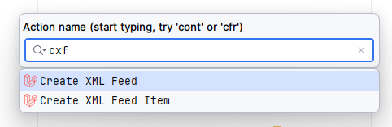

# 📃 Laravel Feeds


[![Stable Version][badge_stable]][link_packagist]
[![Total Downloads][badge_downloads]][link_packagist]
[![Github Workflow Status][badge_build]][link_build]
[![License][badge_license]][link_license]

**Laravel Feeds** is an easy and fast way of exporting a large amount of data to feeds for marketplaces and other
consumers.

> **🌟 Features**
>
> - Chunked queries to database
> - Draft mode for a process
> - Easy property mapping
> - Generation of any XML (feeds, sitemaps, etc.)

## Installation

To get the latest version of **Laravel Feeds**, simply require the project
using [Composer](https://getcomposer.org):

```Bash
composer require dragon-code/laravel-feeds
```

After that, publish the configuration file by call the console command:

```bash
php artisan vendor:publish --tag=feeds
```

## Usage

> [!TIP]
>
> You can find examples of implementations in the [Wiki](https://github.com/TheDragonCode/laravel-feeds/wiki).

### Create Feeds and Feed Items

#### Use a Laravel Idea plugin for PHP Storm

You can also easily create the desired classes using the [Laravel Idea](http://laravel-idea.com) plugin
for [PhpStorm](https://www.jetbrains.com/phpstorm/):



#### Use Artisan

```bash
# This will create a `app/Feeds/UserFeed.php` file
php artisan make:feed User

# This will create a `app/Feeds/UserFeed.php` and `app/Feeds/Items/UserFeedItem.php` files
php artisan make:feed User --with-item

# This will create a `app/Feeds/Items/UserFeedItem.php` file
php artisan make:feed-item User
```

### Generate Feeds

To generate feeds, create the classes of feeds and its element, add links to the file `config/feeds.php`, next call the
console command:

```bash
php artisan feed:generate
```

Each feed can be created in a certain folder of a certain storage.

To indicate the storage, reduce the property of `$storage` in the feed class:

```php
class UserFeed extends Feed
{
    protected string $storage = 'public';
}
```

By default, `public`.

The path to the file inside the storage is indicated in the `filiname` method:

```php
class UserFeed extends Feed
{
    public function filename(): string
    {
        return 'your/path/may/be/here.xml';
    }
}
```

By default, the class name in `kebab-case` is used. For example, `user-feed.xml` for `UserFeed` class.

### Filling

#### Feed

For example, we use this content for the Feed class:

```php
namespace App\Feeds;

use App\Feeds\Items\UserFeedItem;
use App\Models\User;
use DragonCode\LaravelFeed\Feeds\Feed;
use DragonCode\LaravelFeed\Feeds\Items\FeedItem;
use Illuminate\Database\Eloquent\Builder;
use Illuminate\Database\Eloquent\Model;

class UserFeed extends Feed
{
    public function builder(): Builder
    {
        return User::query()
            ->whereNotNull('email_verified_at')
            ->where('created_at', '>', now()->subYear());
    }

    public function item(Model $model): FeedItem
    {
        return new UserFeedItem($model);
    }
}
```

#### Feed Item

For example, we use this content for the Feed Item class:

```php
namespace App\Feeds\Items;

use DragonCode\LaravelFeed\Feeds\Items\FeedItem;

/** @property-read \App\Models\User $model */
class UserFeedItem extends FeedItem
{
    public function toArray(): array
    {
        return [
            'name'   => $this->model->name,
            'email' => $this->model->email,

            'header' => [
                '@attributes' => [
                    'my-key-1' => 'my value 1',
                    'my-key-2' => 'my value 2',
                ],
                '@cdata' => '<h1>' . $this->model->name . '</h1>',
            ],
        ];
    }
}
```

According to this example, the XML file with the following contents will be generated as a result:

```xml
<?xml version="1.0" encoding="UTF-8"?>
<users>
    <user>
        <name>John Doe</name>
        <email>john.doe@example.com</email>
        <header my-key-1="my value 1" my-key-2="my value 2"><![CDATA[<h1>John Doe</h1>]]></header>
    </user>
</users>
```

### Objects, attributes and more

#### Setting the root element

```php
class UserFeed extends Feed
{
    public function rootItem(): ?string
    {
        return 'users';
    }
    
    public function rootAttributes(): array
    {
        return [
            'foo' => 'some value',
        ];
    }
}
```

#### Adding attributes for the main section

```php
class UserFeedItem extends FeedItem
{
    public function attributes(): array
    {
        return [
            'id' => $this->model->id,
            'created_at' => $this->model->created_at->format('Y-m-d'),
        ];
    }

    public function toArray(): array
    {
        // ...
    }
}
```

#### Adding attributes for nested elements

> [!NOTE]
>
> Reserved names are:
>
> - `@attributes`
> - `@cdata`
> - `@mixed`

```php
class UserFeedItem extends FeedItem
{
    public function toArray(): array
    {
        return [
            'name'   => $this->model->name,
            'email' => $this->model->email,

            'header' => [
                '@cdata' => '<h1>' . $this->model->name . '</h1>',
            ],

            'names' => [
                'Good guy' => [
                    '@attributes' => [
                        'my-key-1' => 'my value 1',
                        'my-key-2' => 'my value 2',
                    ],

                    'name'   => 'Luke Skywalker',
                    'weapon' => 'Lightsaber',
                ],

                'Bad guy' => [
                    'name' => [
                        '@cdata' => '<h1>Sauron</h1>',
                    ],

                    'weapon' => 'Evil Eye',
                ],
            ],
        ];
    }
}
```

#### Header information

If it is necessary to change the file cap, override the `header` method in the feed class:

```php
class UserFeed extends Feed
{
    public function header(): string
    {
        return '<?xml version="1.0" encoding="UTF-8"?>';
    }
}
```

## License

This package is licensed under the [MIT License](LICENSE).


[badge_build]:          https://img.shields.io/github/actions/workflow/status/TheDragonCode/laravel-feeds/tests.yml?style=flat-square

[badge_downloads]:      https://img.shields.io/packagist/dt/dragon-code/laravel-feeds.svg?style=flat-square

[badge_license]:        https://img.shields.io/packagist/l/dragon-code/laravel-feeds.svg?style=flat-square

[badge_stable]:         https://img.shields.io/github/v/release/TheDragonCode/laravel-feeds?label=packagist&style=flat-square

[link_build]:           https://github.com/TheDragonCode/laravel-feeds/actions

[link_license]:         LICENSE

[link_packagist]:       https://packagist.org/packages/dragon-code/laravel-feeds

[link_website]:         https://deploy-operations.dragon-code.pro
